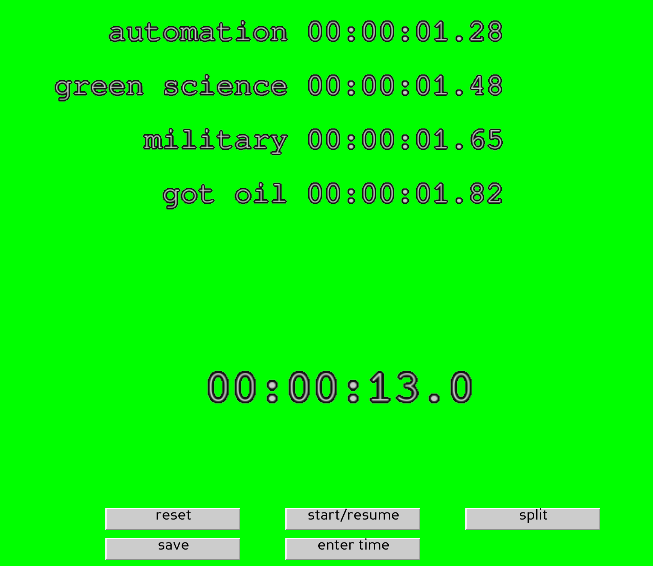

this is a super quick speedrun timer I made because livesplit doesn't work on linux. well. at least for me. I didn't want to compile the dot net.

features:

allows you to save times
allows you to enter a number
allows you to set names for the "splits"
you have to do it in the script though.

uses my panda interface glue to make the buttons / text / text entry, that's open source and MIT too and not too complicated, if you dont' want to install it, you can just inline the relevant functions.

otherwise it just depends on panda and standard library stuff.

